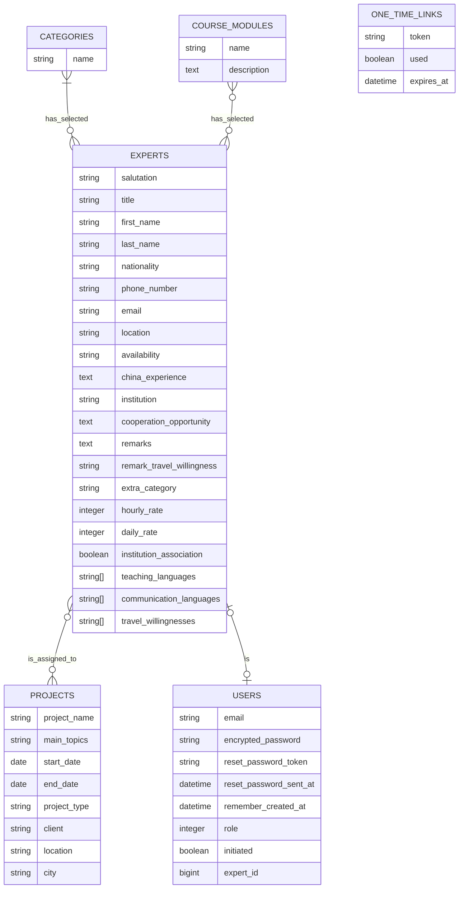

# XPert
Softwareprojekt aus der Vorlesung "Labor für Softwareprojekt und Project Skills" der Hochschule Heilbronn. Das Projekt beinhaltet eine Ruby on Rails Webapplikation zum Verwalten von Experten und Projekten.

Entwickelt mit ❤️ von:
  - Dilara Ergen
  - Zümra Kurban
  - [Micha Aldinger](https://github.com/Z0rumi)
  - [Nick Megler] (https://github.com/NickMegler)
  - Marcel Illenseer

# Entwicklerhandbuch
## Techstack

Für die Entwicklung benutzen wir folgende Technologien:
- [Ruby on Rails](https://rubyonrails.org/) Webanwendungsframework basierend auf einer Model-View-Controller Architektur. Enthält die Logik des Projekts.
- [Tailwind CSS](https://tailwindcss.com/) Utility-First CSS Framework für die Gestaltung der UI. Ermöglicht es Layout und Design direkt im HTML Code festzulegen.
- [PostgreSQL](https://www.postgresql.org/) Relationale Datenbank zur Speicherung und Verwaltung der Anwendungsdaten.
- [Docker](https://www.docker.com/) Containerisierungsplattform zur Standardisierung der Entwicklungsumgebung.

## App Hosting mit Docker

### Voraussetzungen
1. Docker Engine (Linux) bzw. [Docker Desktop](https://www.docker.com/products/docker-desktop/) (Windows/MacOS) installiert und gestartet.
2. [Git](https://git-scm.com/downloads) installiert und konfiguriert.

### Repository klonen
1. Erstelle ein Verzeichnis für das Xpert Portal.
2. Navigiere mit einer Shell deiner Wahl in das Verzeichnis.
3. Repository klonen: `git clone <http clone url>`

### Entwicklungsumgebung

#### .env Datei erstellen
1. Im Projektverzeichnis eine neue Datei mit dem Namen ".env" anlegen. Diese Datei wird für die lokale Datenbank- und SMTP Serveranbindung benutzt.
2. Die .env Datei öffnen und Umgebungsvariablen festlegen. Wichtig: die Namen der Variablen **müssen** identisch zu den in der docker-compose.yml definierten Namen sein!
```
POSTGRES_USER=yourDbUsername
POSTGRES_PASSWORD=yourDbPassword
POSTGRES_DB=prodDbName
DATABASE_HOST=db
DATABASE_URL=postgres://yourDbUsername:yourDbPassword@db:5432/prodDbName
DATABASE_USERNAME=yourDbUsername
DATABASE_PASSWORD=yourDbPassword
SMTP_USERNAME=yourSmtpUsername
SMTP_PASSWORD=yourSmtpPassword
```
3. .env Datei abspeichern.

#### Docker Container starten
1. Navigiere mit deiner Shell in das Root Verzeichnis des Projekts.
2. Führe `docker compose up --build` aus. Die 3 Container db, app und tailwind starten nun nacheinander.

#### Datenbank migrieren
1. Starte den App Container mit einer Shell: `docker compose run app bash`
2. Erstelle die lokale test und dev Datenbank mit `rails db:create`
3. Migriere die lokale Datenbank mit `rails db:migrate`
4. Teste den Status indem du auf deinem Hostsystem die Seite [http://localhost:3000/](http://localhost:3000/) aufrufst.
5. Happy Coding! :keyboard:

### Produktionsumgebung

#### .env Datei erstellen

**Hinweis:** Für die Produktionsumgebung kommen zusätzlich die Variablen RAILS_ENV, SECRET_KEY_BASE, SSL_KEY_PATH und SSL_CERT_PATH hinzu. Wie man an diese gelangt wird im Folgenden erklärt.

- SECRET_KEY_BASE muss per `rails secret` generiert werden. Das Secret dann anschließend in die .env schreiben.
- SSL_KEY_PATH/SSL_CERT_PATH Hier muss der Pfad zum SSL Zertifikat und zum SSL Schlüssel angegeben werden. Das Zertifikat kann für Testzwecke auch self-signed generiert werden. bspw. mit OpenSSL siehe [hier.](https://www.ibm.com/docs/en/api-connect/10.0.x?topic=profile-using-openssl-generate-format-certificates)<br>

1. Im Projektverzeichnis eine neue Datei mit dem Namen ".env" anlegen.
2. Die .env Datei öffnen und Umgebungsvariablen festlegen. Wichtig: die Namen der Variablen **müssen** identisch zu den in der docker-compose.yml definierten Namen sein!
```
POSTGRES_USER=yourDbUsername
POSTGRES_PASSWORD=yourDbPassword
POSTGRES_DB=prodDbName
DATABASE_HOST=db
DATABASE_URL=postgres://yourDbUsername:yourDbPassword@db:5432/prodDbName
DATABASE_USERNAME=yourDbUsername
DATABASE_PASSWORD=yourDbPassword
SMTP_USERNAME=yourSmtpUsername
SMTP_PASSWORD=yourSmtpPassword
RAILS_ENV=production
SECRET_KEY_BASE=yourSecretKeyBase
SSL_KEY_PATH=yourPathToSslKey
SSL_CERT_PATH=yourPathToSslCert
```
3. .env Datei abspeichern.

#### Docker Compose anpassen
Für die Produktionsumgebung muss die docker-compose.yml wie folgt angepasst werden:
```
services:
  db:
    image: postgres:17
    ports:
      - "127.0.0.1:5432:5432"
    volumes:
      - db_data:/var/lib/postgresql/data
    environment:
      - POSTGRES_USER
      - POSTGRES_PASSWORD
      - POSTGRES_DB
    healthcheck:
      test: ["CMD-SHELL", "psql -U $POSTGRES_USER -d $POSTGRES_DB -c 'SELECT 1'"]
      interval: 20s        
      timeout: 10s         
      retries: 5           
      start_period: 10s  

  app:
    build: .
    ports:
      - "127.0.0.1:3000:3000"
    volumes:
      - "./:/app"
    depends_on:
      db:
        condition: service_healthy
      
    environment:
      - RAILS_ENV
      - SECRET_KEY_BASE
      - DATABASE_HOST
      - DATABASE_USERNAME
      - DATABASE_PASSWORD
      - DATABASE_URL
      - SMTP_USERNAME
      - SMTP_PASSWORD
      - SSL_KEY_PATH
      - SSL_CERT_PATH
    command: rails s -b 'ssl://0.0.0.0:3000?key=${SSL_KEY_PATH}&cert=${SSL_CERT_PATH}&verify_mode=none&ca=${SSL_CERT_PATH}'
  
  tailwind:
    build: .
    volumes:
      - "./:/app"
    depends_on:
      db:
        condition: service_healthy
    command: rails tailwindcss:watch
    stdin_open: true
  
volumes:
  db_data:
```

#### Docker Container starten
1. Navigiere mit deiner Shell in das Root Verzeichnis des Projekts.
2. Führe `docker compose up --build` aus. Die 3 Container db, app und tailwind sollten nun nacheinander starten.

#### Datenbank migrieren
1. Starte den App Container mit einer Shell: `docker compose run app bash`
2. Erstelle die prod Datenbank mit `rake db:create`
3. Migriere die prod Datenbank mit `rake db:migrate`
4. Teste den Status indem du auf deinem Hostsystem die Seite [https://localhost:3000/](https://localhost:3000/) aufrufst.

## Softwaredokumentation
### ER-Diagramm
#### Stand: 13.01.2025



## Wichtige Befehle
Im Folgenden werden Commands aufgelistet, die in der Entwicklung mit Rails häufig verwendet werden.
### Rails Testing
1. `rails test` für alle Model, Controller und Integrationstests
2. `rails test:system` für System Tests mit Selenium
3. `bundle exec rubocop` für Checkstyle Überprüfung
4. `bundle exec rubocop -a` um alle autocorrectfähigen Offenses von Rubocop zu beseitigen.

### Rails Operations
1. `rails db:drop` zum Löschen der lokalen Datenbanken (test und dev)
2. `rails db:create` zum Bauen neuer lokaler Datenbanken (test und dev)
3. `rails db:seed` führt das db/seeds.rb script aus. Kann genutzt werden, um die test und dev DB mit Beispieldaten zu befüllen
4. `rails c` um die rails Console zu öffnen. Praktisch um Objekte händisch und während der Laufzeit erstellen, löschen und bearbeiten zu können.

### Manuelle Usererstellung
1. `User.create(email: 'example@mail.de', password: 'password123', password_confirmation: 'password123', role: 2)` (In rails c eingeben) um einen neuen User mit der staff Rolle zu erstellen. Folgende Rollen stehen zur Auswahl: 0: expert (default), 1: intern, 2: staff, 3: admin

